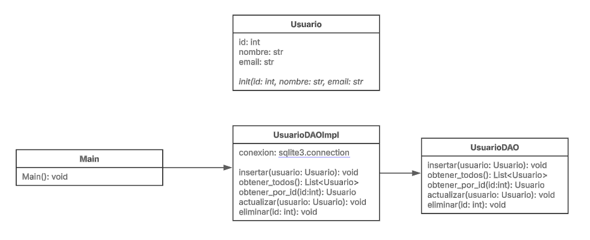

# EjemploDAO - Patrón Data Access Object (DAO) en Python

Este proyecto es un ejemplo de implementación del **patrón de diseño DAO (Data Access Object)** en Python, utilizando SQLite como base de datos.

## Características
- Implementa un sistema de acceso a datos con DAO.
- Usa **SQLite** para el almacenamiento de datos.
- Permite operaciones **CRUD** (Crear, Leer, Actualizar y Eliminar).
- Utiliza **clases y abstracción** para separar la lógica de acceso a datos.

## Instalación
1. Clona el repositorio:
   ```bash
   git clone https://github.com/SebastianNC9/EjemploDAO.git

## Uso

El programa permite:
- Insertar un usuario
- Listar todos los usuarios
- Buscar un usuario por ID
- Actualizar un usuario
- Eliminar un usuario

## Diagrama UML

